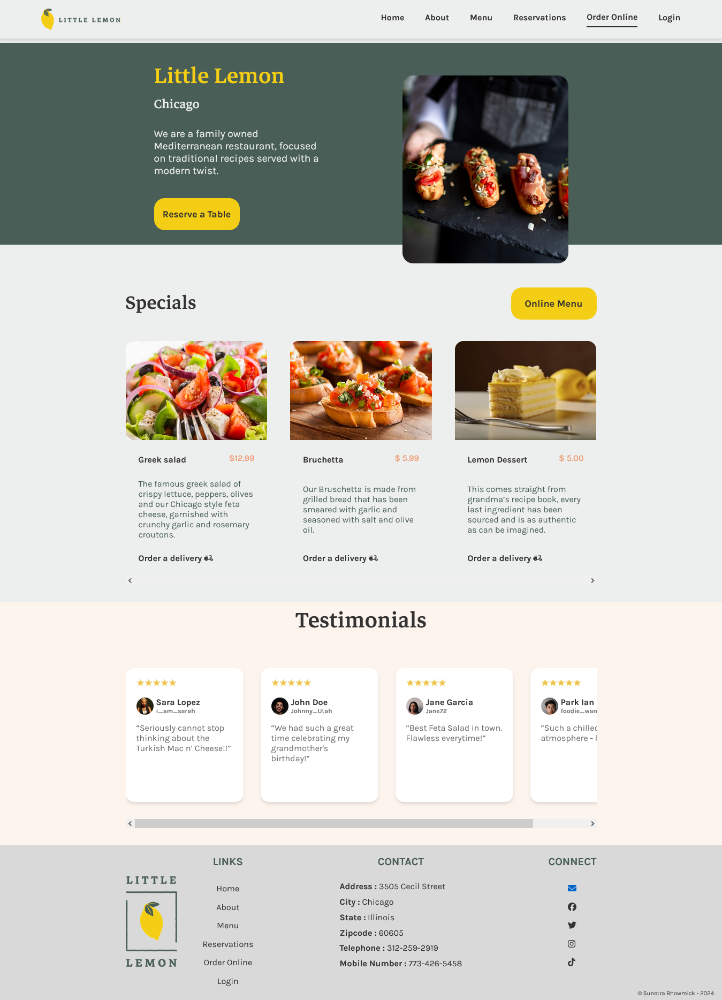

# Little Lemon Restaurant Website

The aim of the project is to build a fully functional website frontend for the restaurant, Little Lemon, including at least a landing page and a table reservation page, using basic and advanced React principles. It is also important to take note of the responsiveness and performance of the website. This project is the final assignment for <b>Meta Front-end Developer Capstone Project course</b>, provided via Coursera.

To get a feel of how the project looks like - [click here](https://thelittlelemonchicago.netlify.app/). I have also included the links below. [Click here](#connect-with-me) to connect with me for collaboration or exciting job opportunity.

Check out the course here - [Meta Front-end Developer Capstone Project](https://www.coursera.org/learn/meta-front-end-developer-capstone?specialization=meta-front-end-developer). 

## Table of contents

- [Overview](#overview)
  - [The Objective](#the-objective)
  - [Screenshot](#screenshot)
  - [Links](#links)
- [Launch Guide](#launch-guide)
  - [The Cloning](#the-cloning)
  - [Launch the App](#launch-app)
- [The Process](#the-process)
  - [Technologies Used](#technologies-used)
  - [Libraries Used](#libraries-used)
  - [Challenges Faced](#challenges-faced)
- [Further Development](#further-development)
  - [Enhancement Opportunities](#enhancement)
  - [Acknowledgment](#useful-resources)
- [Connect With Me](#connect-with-me)

## Overview

### The objective

Users should be able to:

- Visit and navigate into different sections the webpage using the navigation bar
- Reserve a table for a selected date and time
- Detect any error that may occur during the table reservation process
- Get a confirmation after a successful reservation
- View the optimal layout for the app depending on their device's screen size
- See hover states for all interactive elements on the page

### Screenshot



### Links

- Repository URL : [GitHub Repo](https://github.com/kaiser-sb/little-lemon-capstone)
- Live Site URL : [Little Lemon Website](https://thelittlelemonchicago.netlify.app/)

## Launch Guide

### The Cloning

Copy the code snippet below to start working with the repo.

```shell
$ git clone https://github.com/kaiser-sb/little-lemon-capstone
$ cd little-lemon-capstone
$ npm install
```

### Launch the App

Use the following command to run the app in your localhost.

```
npm start
```

## The Process

### Technologies Used

- HTML5 (Semantic)
- CSS (Flexbox and Grid)
- JavaScript (ES6)
- React
- React Hooks and Libraries
- Responsive Web Designing

### Libraries Used

The follwoing libraies are used for the project -

```shell
react-router-dom

@fortawesome/react-fontawesome

@fortawesome/free-brands-svg-icons

@fortawesome/free-solid-svg-icons

```
### Challenges Faced

The API link provided by Meta to populate the available time slots in reservation page was somehow broken. This issue had to be fixed by somewhat mocking the API action in the project itself.

## Further Development

### Enhancement Opportunities

I am looking forward to enhance the `Menu` section as well as building the `Order Online` & `Login` section. In future, I look forward to develop this into a full-fledged Full Stack Website.

### Acknowledgment

I would like to thank my fellow learners in the Meta course, who posted numerous solutions in the discussion forums to overcome various kinds of difficulties encountered throughout the project - especially in case of the broken API link.

## Connect With Me

If you want to discuss opportunities of collaboration, jobs or freelancing - feel free to reach out to me in any of the following platform, and I'll be happy to connect!

- My Website - [Portfolio Website](https://sunetrabhowmick3.wordpress.com/)
- My LinkedIn Profile - [kaiser-sb](https://www.linkedin.com/in/kaiser-sb/)
- My Xing Profile - [Sunetra Bhowmick](https://www.xing.com/profile/Sunetra_Bhowmick/web_profiles)
- My GitHub - [@kaiser-sb](https://github.com/kaiser-sb)
